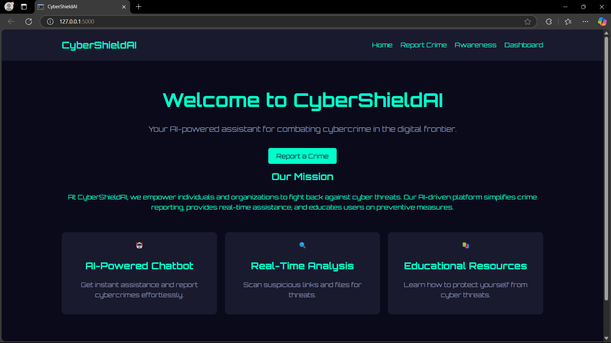

# CyberShieldAI

## Your Digital Guardian Against Cybercrime

Unleash the power of **CyberShieldAI**, an innovative AI-driven platform **Developed By HackAttack** to combat cybercrime in India’s digital frontier! Chat with our intelligent bot to effortlessly report cybercrimes like phishing, hacking, and identity theft—your conversation seamlessly transforms into a detailed report, mailed instantly to the nearest crime branch for swift action. Stay informed with our cutting-edge dashboard, offering a real-time pulse of cybercrime cases across India, alongside your personalized case stats. From uploading evidence to exploring cybersecurity tips via our Awareness AI, CyberShieldAI empowers you to strike back at cyber threats with precision and speed—because your safety is our mission!

---



## Features

- **Conversational Report Generation**: Chat with the AI to create detailed cybercrime reports without filling out forms.
- **Report Mailing to Crime Branch** *(In Progress)*: Automatically emails the generated report to the corresponding regional cybercrime branch.
- **Real-Time Dashboard** *(In Progress)*: View live cybercrime case statistics across India, plus your own report metrics (total, pending, resolved).
- **Evidence Upload**: Attach screenshots, PDFs, or files during the chat to bolster your report.
- **Awareness AI**: Get instant, tailored cybersecurity education from our dedicated AI assistant.
- **Sleek Cyberpunk UI**: A neon-lit, futuristic interface for an engaging user experience.

---

## Project Structure

```
C:.
|   app.py               # Main Flask application
|   database.db          # SQLite database for storing reports
|   requirements.txt     # Python dependencies
|   .env                 # Environment variables (e.g., GOOGLE_API_KEY)
|   README.md            # Project documentation
|   
+---static
|   |   script.js        # Client-side JavaScript for interactivity
|   |   style.css        # CSS for styling with a cyberpunk theme
|   |   
|   +---fonts            # (Optional) Custom fonts
|   \---images           # (Optional) Static images
\---templates
        base.html        # Base HTML template
        dashboard.html   # Dashboard page
        home.html        # Home page
        report.html      # Report generation page
        awareness.html   # Cybersecurity awareness page
```

---

## Prerequisites

- **Python 3.8+**: Ensure Python is installed on your system.
- **Google Gemini API Key**: Obtain an API key from [Google AI Studio](https://aistudio.google.com/app/apikey) for AI functionality.
- **SMTP Server**: For emailing reports (e.g., Gmail SMTP with app password).

---

## Setup Instructions

1. **Clone the Repository**:
   ```bash
   git clone <repository-url>
   cd CyberShieldAI
   ```

2. **Install Dependencies**:
   ```bash
   pip install -r requirements.txt
   ```

3. **Set Up Environment Variables**:
   - Create a `.env` file in the project root:
     ```
     GOOGLE_API_KEY=your_gemini_api_key_here
     SMTP_EMAIL=your_email@gmail.com        # For report mailing
     SMTP_PASSWORD=your_app_password        # Gmail app password or similar
     ```
   - Replace `your_gemini_api_key_here`, `your_email@gmail.com`, and `your_app_password` with your actual credentials.

4. **Run the Application**:
   ```bash
   python app.py
   ```
   - Open your browser and navigate to `http://127.0.0.1:5000/`.

---

## Usage

1. **Home Page**: Start here to explore CyberShieldAI’s mission and features.
   - Navigate via the top bar to Report Crime, Awareness, or Dashboard.

2. **Report Crime**:
   - Chat with the AI to describe the cybercrime (e.g., "I got a phishing email yesterday").
   - Upload evidence (screenshots, PDFs) if needed.
   - Once complete, click "Submit Report" to save and email it to the crime branch.

3. **Awareness**:
   - Ask the AI about cybersecurity topics (e.g., "How do I prevent phishing?").
   - Receive instant, educational responses.

4. **Dashboard**:
   - View your report stats (total, pending, resolved).
   - Check real-time cybercrime case trends across India (feature in progress).

---

## New Features (In Progress)

### 1. Report Mailing to Crime Branch
- **Description**: After submitting a report, it’s emailed to the appropriate regional cybercrime branch based on the incident’s details or user location.
- **To Implement**:
  - Add SMTP configuration in `app.py` using `smtplib`.
  - Map crime types or locations to email addresses (e.g., a dictionary of regional cybercrime branch emails).
  - Send the report as a formatted email with attached evidence.

### 2. Real-Time Dashboard
- **Description**: Displays live cybercrime case statistics across India alongside user-specific data.
- **To Implement**:
  - Integrate a public cybercrime API (e.g., from Indian government sources) or simulate data with WebSocket updates.
  - Enhance `dashboard.html` with charts (e.g., using Chart.js) for real-time visualization.
  - Fetch and display data in `/dashboard` route.

---

## Dependencies

- **Flask**: Web framework for Python.
- **google-generativeai**: Gemini API integration for AI capabilities.
- **python-dotenv**: Load environment variables from `.env`.
- **sqlite3**: Lightweight database for report storage.

See `requirements.txt` for full details.

---

## Contributing

Feel free to fork this repository, submit pull requests, or open issues for bugs and feature suggestions. Let’s make cyberspace safer together!

---

## License

© 2025 CyberShieldAI, Developed By HackAttack. All rights reserved.
```

---

### **How to Save as a File**
1. **Manual Method**:
   - Open a text editor (e.g., Notepad, VS Code).
   - Copy the entire text above.
   - Save it as `README.md` in your project root directory (e.g., `C:/CyberShieldAI/README.md`).

2. **Command Line Method (Linux/Mac)**:
   - Open a terminal in your project directory.
   - Run:
     ```bash
     echo "# CyberShieldAI" > README.md
     ```
   - Then append the rest by copying the content into the file using your editor or a command like:
     ```bash
     cat << 'EOF' >> README.md
     ## Your Digital Guardian Against Cybercrime
     Unleash the power of **CyberShieldAI**, an innovative AI-driven platform **Developed By HackAttack** to combat cybercrime in India’s digital frontier! Chat with our intelligent bot to effortlessly report cybercrimes like phishing, hacking, and identity theft—your conversation seamlessly transforms into a detailed report, mailed instantly to the nearest crime branch for swift action. Stay informed with our cutting-edge dashboard, offering a real-time pulse of cybercrime cases across India, alongside your personalized case stats. From uploading evidence to exploring cybersecurity tips via our Awareness AI, CyberShieldAI empowers you to strike back at cyber threats with precision and speed—because your safety is our mission!
     [rest of the content...]
     EOF
     ```
   - Replace `[rest of the content...]` with the full text above if using this method.

3. **Verify**:
   - Ensure the file appears in your project root alongside `app.py`, `requirements.txt`, etc.

---

This is the complete `README.md` content in a single text format, ready to be imported into your project. Let me know if you need assistance with saving it or implementing the new features mentioned!